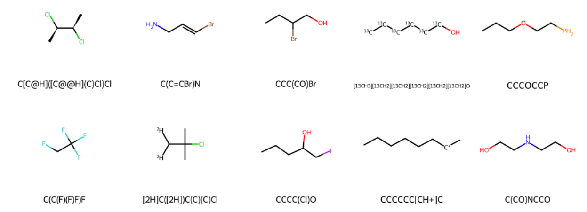

# Molecular-Machine-Learning
Exploring Data Science applications in Chemistry : Chemical Property Prediction.

#Introduction
Data science methods can be applied universally, limited only by the availability of data. Chemistry, although precise, requires data for analysis. Various areas in chemistry, such as predicting properties of molecules based on their descriptors or determining the descriptors for molecules with specific properties, pose challenges that data science can address. These are known as QSPR and QSAR problems. Previous solutions have employed chemical, mathematical, and quantum mechanics-based approaches, which are computationally intensive and not always precise. This situation parallels the common issue of prolonged property value determination. The potential for expediting these processes through data science is worth exploring.

**SMILES **(Simplified Molecular Input Line Entry System): SMILES uses simplified notations with chemical symbols and special characters to represent molecules, making it easily accessible and suitable for conveying main chemical concepts.

**MDL Molfile**: The MDL Molfile is a file format that encapsulates atom, bond, and structural information, providing compatibility with most cheminformatics software and the ability to represent both 2D and 3D molecular structures.

**Coulomb Matrices and Quantum Descriptors**: These methods utilize the principles of quantum chemistry, such as the Coulomb matrix and custom quantum approaches, to derive molecular properties from complex equations, requiring accurate atom coordinates and nuclear charges.

**Custom Descriptors**: Custom descriptors involve crafting specific properties, like bond counts and atom groups, either manually or from existing representations, offering flexibility but demanding careful design and consideration of processing needs.

